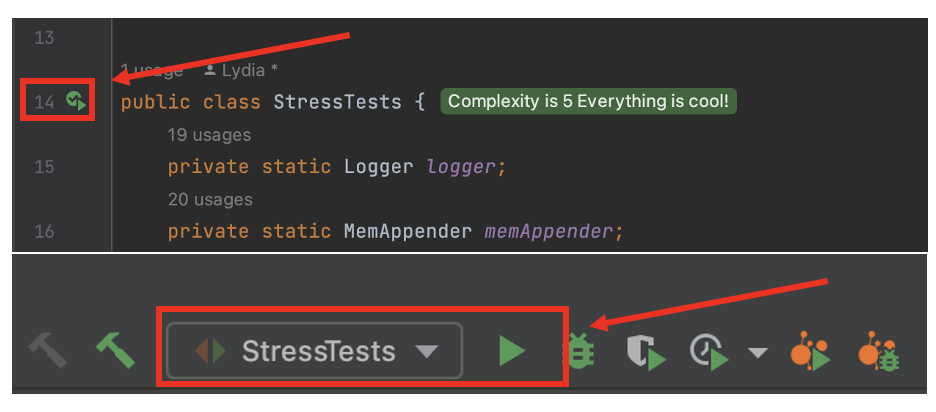

# Assignment2 251 159.251
## Lydia Price, ID: 20004521

### To Run Tests:
JUnit tests can be run via the  `mvn clean test` or `mvn test`  from the 
command line or via the maven tab in your IDE. This will automatically run
all tests excluding the Console Appender Stress Tests. This was done because
with it included, the tests took far too long.

It is best to run the Console Appender Stress Tests from within your IDE. For example, within
Intellij IDEA, the tests can be run from either the gutter beside the declaration
of the class name, or by selecting and running the run configuration. An example 
of this is shown below. This can also be done for the individual tests themselves. 

### MBean JMX Monitoring
Implementation of an MBean object - SystemStatus for each instance of MemAppender is created for JMX monitoring of
log messages as an array list, the estimated size of cached logs (the number of characters from getEventString()),
and the number of discarded logs.

There is a function within the SystemStatus.java to automatically update the SystemStatus object. 
This is best in a 'main' programme rather than tests as it added time to the tests.

This can be updated from within JConsole by selecting the relevant operation methods:
- `setSizeCachedLogs()`
- `setLogMessages()`
- `setDiscardedLogs()`

### Reports
[performance-analysis.pdf](reports/performance-analysis.pdf) and [coverage.html](reports/coverage.html) are both 
located within the `reports` directory

